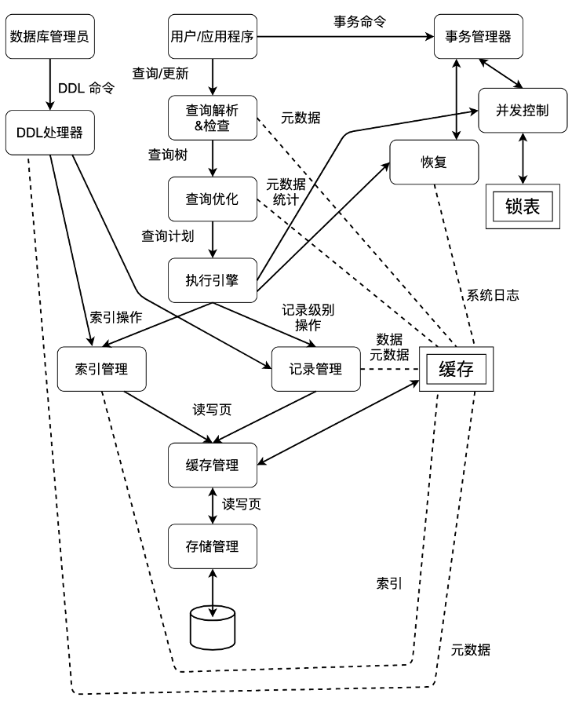

## 第一章 数据库管理系统概述

### 1. DBMS的组成

- **存储管理**

  > 控制数据在磁盘上的存储及磁盘与内存间的交换

- **缓存管理**

  > 将内存划分为与页面同等大小的帧，所有上层模块需要与缓存管理交互获取数据

- **DDL命令**

  > DDL即数据定义语言，由特权用户执行，借DDL处理器解析，调用**记录管理器**及**索引管理器**对元数据修改

- **DML命令**

  > DML即数据操纵语言，由用户执行，经解析检查、优化和执行得到结果

- **事务处理**

  > 用户定义的一组操作，满足ACID特性，执行登记日志、并发控制等操作

### 2. 关系模型

- **关系**：无序的元组集合

- **主键**：唯一标识，体现**实体完整性约束**
- **外键**：参照标识，体现**参照完整性约束**

- **关系代数**：过程化语言

### 3. SQL的基本使用

